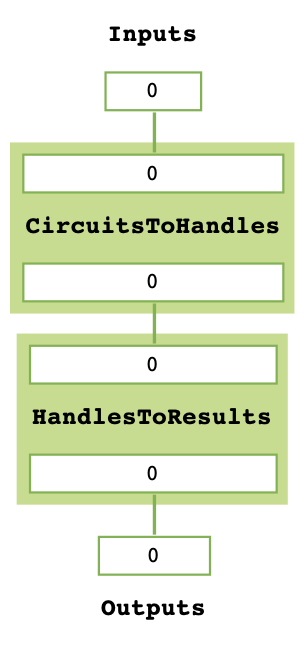

Qermit
======

.. image:: CQCLogo.png
   :width: 120px
   :align: right

``qermit`` is a python module for running error-mitigation protocols on quantum computers using ``pytket``, 
CQC's python module for interfacing with `CQC <https://cambridgequantum.com/>`_ tket, a set of quantum programming tools. 
``qermit`` functions using the ``pytket`` :py:class:`Backend` class, meaning ``qermit`` supports any of the 
`numerous providers <https://github.com/CQCL/pytket-extensions>`_ ``pytket`` does.
``qermit`` also provides easy composability of error-mitigation methods, meaning 
it is practically straightforward to run an experiment with multiple forms of error-mitigation 
where appropriate.

``qermit`` is compatible with ``pytket`` 1~.

To install, run

``pip install qermit``

To use ``qermit``, simply import the appropriate modules into your python code or into an interactive Python notebook.

Error-mitigation methods in ``qermit`` fit in to two distinctions, ``MitRes`` methods 
that result in a modification of a distribution of counts  retrieved from some 
quantum computer, and ``MitEx`` methods that result in the modification of the 
expectation value of some observable.

In their basic capacity, ``MitRes`` and ``MitEx`` objects will run experiments without error-mitigation.

::

   from qermit import MitRes, CircuitShots
   from pytket import Circuit
   from pytket.extensions.qiskit import AerBackend

   mitres = MitRes(backend = AerBackend())
   c = Circuit(2,2).H(0).Rz(0.25,0).CX(1,0).measure_all()
   results = mitres.run([CircuitShots(Circuit = c, Shots = 50)])
   print(results[0].get_counts())

::
   
   Counter({(0, 0): 25, (1, 0): 25})

The ``MitRes.run`` method takes a list of ``CircuitShots`` as an argument
and returns a ``pytket`` ``BackendResult`` object for each list element.

The ``MitRes`` and ``MitEx`` objects hold a graph of ``MitTask`` objects (a ``TaskGraph``). A ``MitTask``
object is a pure function that computes some basic step in a typical experiment. When the run function
is called, a topological sort is applied to the graph to order these tasks and then each is run sequentially.

In its default construction, a ``MitRes`` object will simply run each Circuit through the backend it is defined by.

::

   mitres.get_task_graph()

Similarly, in its default construction a ``MitEx`` object will simply estimate the expectation of each observable 
desired without applying any mitigation method.

::

   from qermit import MitEx, AnsatzCircuit, ObservableExperiment, ObservableTracker
   from pytket.pauli import Pauli, QubitPauliString
   from pytket.utils import QubitPauliOperator

   mitex = MitEx(backend = AerBackend())
   qubit_pauli_string = QubitPauliString([Qubit(1), Qubit(2)], [Pauli.Z, Pauli.Z])
   qubit_pauli_operator = QubitPauliOperator({qubit_pauli_String: 1.0})
   ansatz_circuit = AnsatzCircuit(
      Circuit = Circuit(3,3).X(0).X(1), 
      Shots = 50, 
      SymbolsDict = SymbolsDict()
   )
   experiment = ObservableExperiment(
      AnsatzCircuit = ansatz_circuit, 
      ObservableTracker = ObservableTracker(qubit_pauli_operator)
   )
   mitex_results = mitex.run([experiment])
   print(mitex_results)

::

   [{(Zq[1], Zq[2]): -1.00000000000000}]

The ``MitEx.run`` method takes a list of ``ObservableExperiment`` objects as an argument. Each ``ObservableExperiment`` objects
contains the basic information required to estimate the expectation value of an observable; a state preparation circuit,
a dictionary between symbols and parameter values (where appropriate), a ``pytket`` ``QubitPauliOperator`` detailing the 
operator being measured and used for preparing measurement circuits, and the number of shots to run for each measurement circuit.

Each experiment returns a ``QubitPauliOperator`` object containing an expectation value for each internal ``QubitPauliString``. In its default
version, this is achieved by appending a measurement circuit for each ``QubitPauliString`` to the ansatz circuit and executing through
the ``pytket`` ``Backend`` the ``MitEx`` object is defined by.

::

   mitex.get_task_graph()

See the Qermit `user manual <https://cqcl.github.io/Qermit/manual/>`_ for an extended tutorial on using ``qermit``, including
pre-defined error-mitigation methods and composing error-mitigation methods.

``qermit`` currently provides the following error-mitigation schemes (under their commonly known names):

* SPAM Correction
* Frame Randomisation
* Zero-Noise Extrapolation
* Probabilistic-Error-Cancellation
* Clifford Data Regression
* Depolarisation-Factor-Supression-For-Nearest-Clifford 

User Support
~~~~~~~~~~~~

If you have problems with the use of Qermit or you think you have found a bug, there 
are several ways to contact us:
- Write an email to tket-support@cambridgequantum.com and ask for help with your problem.
- You can write a bug report on the `CQC github <https://github.com/CQCL/Qermit/issues>`_ with details of the problem and we will pick that up. You can also have a look on that page so see if your problem has already been reported by someone else.

.. toctree::
   :caption: API Reference:
   :maxdepth: 2

   taskgraph.rst
   mitres.rst
   mitex.rst
   utils.rst
   mittask.rst
   measurement_reduction.rst
   spam.rst
   frame_randomisation.rst
   clifford_noise_characterisation.rst
   zero_noise_extrapolation.rst
   probabilistic_error_cancellation.rst
