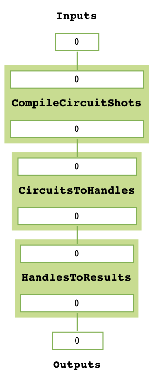
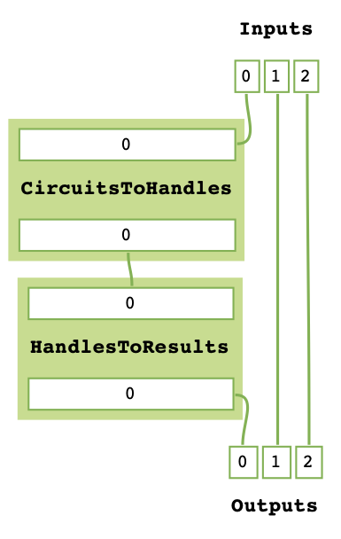
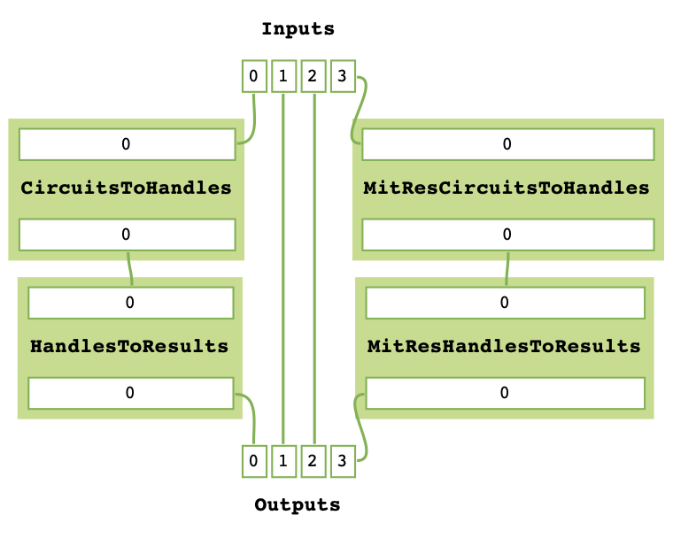
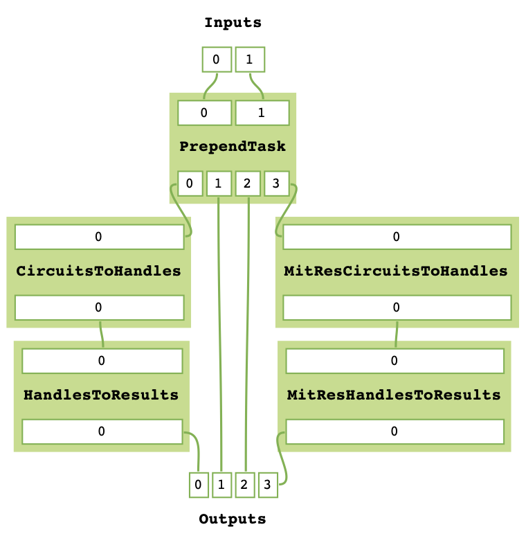
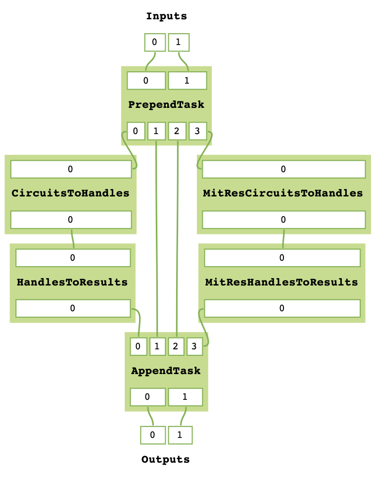
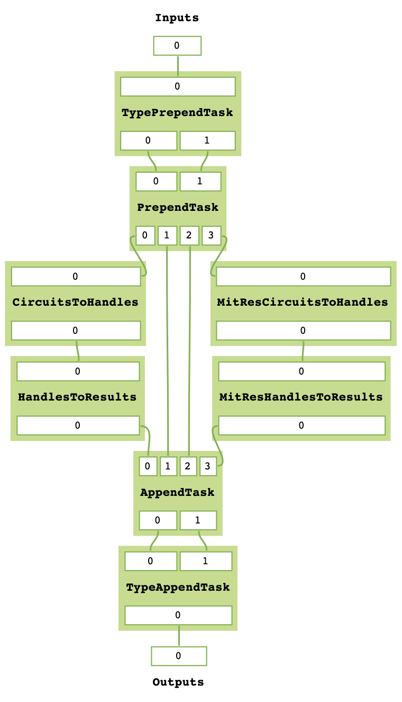
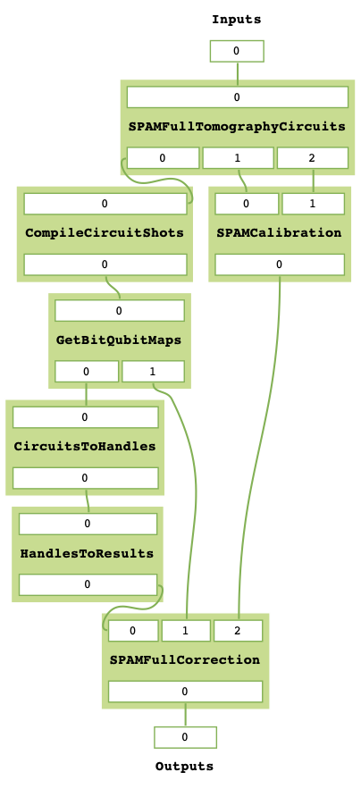
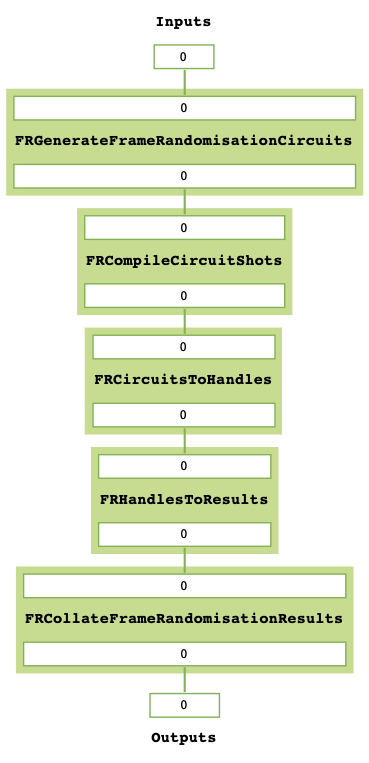
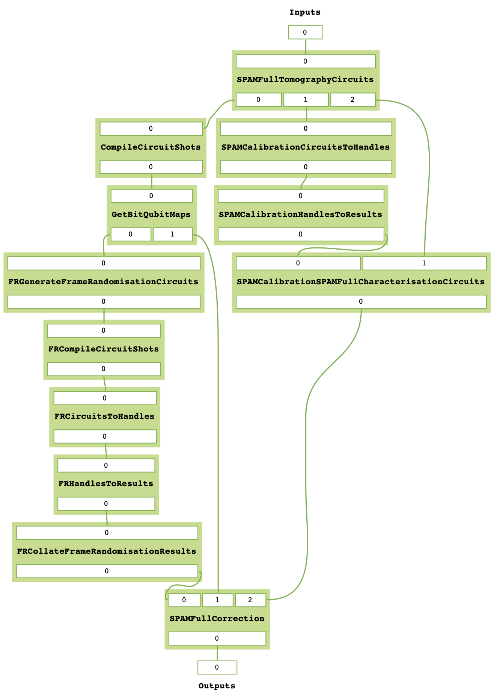

******
MitRes
******

A typical process for running experiments on quantum devices is as follows: first 
a logical quantum circuit is constructed, next it is compiled to fit to the constraints of
the quantum device of choice (such as the connectivity graph or set of gate primitives) before 
being sent to the device via the hardware manufacturers language of choice. Finally
results are returned, typically as a sequence of *Shots*, each shot being a single set of bit
corresponding to the measurement result of each qubit.

In its basic capacity the ``MitRes.run`` `method <https://cqcl.github.io/qermit/mitres.html>`_ will run
each of these tasks sequentially. 

::

   from qermit import MitRes, CircuitShots
   from pytket import Circuit
   from pytket.extensions.qiskit import AerBackend

   mitres = MitRes(backend = AerBackend())
   c = Circuit(2,2).H(0).Rz(0.25,0).CX(1,0).measure_all()
   results = mitres.run([CircuitShots(Circuit = c, Shots = 50)])
   print(results[0].get_counts())

::
   
   Counter({(0, 0): 25, (1, 0): 25})

In the above code snippet a Bell circuit is simulated on the ``AerBackend``, returning a 
``pytket`` BackendResult object.

The ``MitRes`` object holds a graph of ``MitTask`` (or ``TaskGraph``, see later clarification) objects (a ``TaskGraph``). 
A ``MitTask`` object is a pure function that computes some basic step in a typical experiment. 
When the run function is called, a topological sort is applied to the graph to order these tasks. Each is then run sequentially.

The ``MitTask`` objects held in a ``MitRes`` can be visualised with the ``MitRes.get_task_graph`` method.

::

   mitres.get_task_graph()

.. image:: mitresgraph.png

It is also possible to import and use the ``MitTask`` objects directly.

::

    from qermit.taskgraph import backend_handle_task_gen, backend_res_task_gen

    sim_backend = AerBackend()
    circuits_to_handles_task = backend_handle_task_gen(sim_backend)
    handles_to_results_task = backend_res_task_gen(sim_backend)

    print(circuits_to_handles_task)
    print(handles_to_results_task)

    handles = circuits_to_handles_task(([CircuitShots(Circuit = c, Shots = 50)],))
    results = handles_to_results_task(handles)
    print(results[0][0].get_counts())

::

    <MitTask::CircuitsToHandles>
    <MitTask::HandlesToResults>
    Counter({(1, 0): 30, (0, 0): 20})

You may notice that the arguments of the ``MitTask`` objects are different, requiring 
``Tuple`` type objects. This is necessary for the execution in the ``TaskGraph.run`` method.
All typing information is accessible via the ``qermit`` documentation.

Error-mitigation with ``MitRes``
--------------------------------

To produce a ``MitRes`` object that executes an error-mitigation protocol when the ``MitRes.run`` 
method is called, additional ``MitTask`` objects need to be added to its task graph.

The defining characteristic of a ``MitRes`` object is that the first ``MitTask`` object 
in its sorted graph requires a ``List[CircuitShots]`` object as its sole argument and that
the final ``MitTask`` object in its sorted graph returns a ``List[BackendResult]`` object. 
This is a crucial type constraint required for the combining of error-mitigation methods.

Given this, there are two viable approaches to producing error-mitigation ``MitRes`` objects, either
extending a ``MitRes`` object with new ``MitTask`` objects under strict type constraints, or constructing 
a ``TaskGraph`` object with relaxed type constraints on internal tasks and then casting to a ``MitRes`` object at completion.

Extending ``MitRes`` with ``MitTask``
-------------------------------------

We have already seen that the basic construction of a ``MitRes`` object has two ``MitTask`` objects, one
submitting Circuit to a ``pytket`` Backend to retrieve unique handles, the other submitting these handles
back to the Backend to retrieve ``BackendResult``.

The ``MitRes.append`` and ``MitRes.prepend`` methods can be used to extend the 
``MitTask`` objects the ``MitRes._task_graph`` attribute holds.

As an example, Let's construct a basic ``MitRes`` object and then prepend a task that compiles circuits. While a common 
task in any experiment workflow,  the basic ``MitRes`` constructor does not add a ``MitTask`` for compilation. 
This is because error-mitigation methods often produce circuits with very specific structures that need to be retained. 
Even basic compilation may destroy these structures.

:: 

   from qermit import MitTask

A ``MitTask`` object is defined by four attributes: a name, a function it computes, the number of arguments to said 
function and the number of elements in a Tuple it returns.

Let's define a basic function that compiles Circuits to a given Backend.

::

   from pytket import Circuit
   from pytket.backends import Backend
   from typing import List

   def compile_circuits(backend: Backend, circuits: List[Circuit]) -> List[Circuit]:
      for c in circuits:
         backend.compile_circuit(c)
      return circuits

This is a straightforward function definition for those familiar with ``pytket`` and completes our goal. 
However, this will require some minor modification before we can add it to our ``MitRes`` object.

We have already noted that a ``MitRes`` object is defined by the property that the ``MitRes.run`` method
takes a ``List[CircuitShots]`` as an argument and returns a ``List[BackendResult]``. Considering this, 
the ``MitRes.append`` and ``MitRes.prepend`` methods have restrictions on what ``MitTask`` objects they can
add to a task graph.

The ``MitRes.append`` method can only append tasks that have one out wire and return ``Tuple[List[BackendResult]]`` from
the internal method, while the ``MitRes.prepend`` method can only prepend tasks that have one in wire and expects a 
single argument of type ``List[CircuitShots]`` to its internal method. The ``Tuple`` type is necessary for piping data
through the internal graph.

Let's rework the ``compile_circuits`` method to fit the ``List[CircuitShots]`` constraint.

::

   from qermit import CircuitShots
   from typing import Tuple

   def compile_circuit_shots(backend: Backend, circuit_shots: List[CircuitShots]) -> Tuple[List[CircuitShots]]:
      for cs in circuit_shots:
         backend.compile_circuit(cs.Circuit)
      return (circuit_shots,)

Notice that ``MitRes.prepend`` does not allow tasks that pass ``Backend`` objects as arguments. When the ``MitRes`` 
class constructor is called with a given ``Backend``, this same ``Backend`` is used to construct ``<MitTask::CircuitsToHandles>``
and ``<MitTask::HandlesToResults>`` objects via ``MitTask`` generator functions. In this way each method references the same 
``Backend`` object, meaning it can be used to store and pass basic information such as device characteristics.

Let's work the ``compile_circuit_shots`` method here into a similar generator function for a ``MitTask`` object.

::

   def backend_compile_circuit_shots_task_gen(
      backend: Backend
   ) -> MitTask:
      def compile_circuit_shots(obj, circuit_shots: List[CircuitShots]) -> Tuple[List[CircuitShots]]:
         for cs in circuit_shots:
               backend.compile_circuit(cs.Circuit)
         return (circuit_shots,)

      return MitTask(
         _label="CompileCircuitShots", _n_in_wires=1, _n_out_wires=1, _method=compile_circuit_shots
      )

When called, ``backend_compile_circuit_shots_task_gen`` will return a ``MitTask`` object with a callable that 
compiles a ``List[CircuitShots]`` to the defined backend.

::

   from pytket.extensions.qiskit import AerBackend

   sim_backend = AerBackend()
   mit_task = backend_compile_circuit_shots_task_gen(sim_backend)
   print(mit_task)

::

   <MitTask::CompileCircuitShots>

The callable expects a ``Tuple`` of the arguments to the ``MitTask._method`` attribute.

::

   test_circuit_shots = [CircuitShots(Circuit = Circuit(2).CZ(0,1).measure_all(), Shots = 10)]
   test_results = mit_task((test_circuit_shots,))
   print(test_results)

::

   ([CircuitShots(Circuit=[TK1(0.5, 0.5, 0.5) q[1]; CX q[0], q[1]; Measure q[0] --> c[0]; TK1(0.5, 0.5, 0.5) q[1]; Measure q[1] --> c[1]; ], Shots=10)],)

We can see that the circuit has been compiled to the ``AerBackend`` gate set primitive and returned a suitable type - Let's prepend it to 
the basic ``MitRes`` object.

::

   mit_res = MitRes(sim_backend)
   mit_res.prepend(mit_task)
   mit_res.get_task_graph()

If we were to use the ``MitRes.run`` method now to run an experiment, all circuits would be compiled with sim_backend before
being executed on the hardware. The ``MitRes.append`` method works similarly - later examples will show it in use.

Constructing ``MitRes`` from ``TaskGraph``
------------------------------------------

Error-mitigation methods can involve complicated sequences of tasks to work. The strict type requirements of the 
``MitRes`` prepend and append rules preserve properties required for combining error-mitigation methods, but restrict
the possible structure and order of tasks.

If a more complicated structure of tasks is required to perform the mitigation, a ``MitRes`` object can be cast
as a ``TaskGraph`` object without the same restrictions. If the final object after construction respects the
``MitRes`` type constraints then it can be cast back as a ``MitRes`` object later.

:: 

   from qermit import TaskGraph
   
   sim_backend = AerBackend()
   task_graph = TaskGraph().from_TaskGraph(MitRes(sim_backend))
   task_graph.get_task_graph()

.. image:: mitresgraph.png

Additionally to the relaxed type constraints of ``TaskGraph.prepend`` and ``TaskGraph.append`` in relation to ``MitRes``,
the ``TaskGraph`` class has additional construction methods: ``TaskGraph.add_n_wires`` and ``TaskGraph.parallel``.

::

   task_graph.add_n_wires(2)
   task_graph.get_task_graph()

The ``TaskGraph.add_n_wires`` method adds n new edges between the input and output vertices. 
Similarly, the ``TaskGraph.parallel`` method adds a new path between the input and output vertices, 
but with a ``MitTask`` or ``TaskGraph`` object (or child) inserted.

We can add another ``MitRes`` object in parallel:

::

   task_graph.parallel(MitRes(sim_backend))
   task_graph.get_task_graph()

.. image:: taskgraphparallel.png

The ``MitRes`` object is added to the graph as its own callable. The ``MitRes.decompose_TaskGraph_nodes`` method will
recursively substitute any graph node with a ``_task_graph`` attribute with said ``_task_graph``, adding unique names
to aid understanding.

::

   task_graph.decompose_TaskGraph_nodes() 
   task_graph.get_task_graph()

Any ``MitTask`` object we want to pass to ``TaskGraph.prepend`` must have four output wires and any number of input wires, while 
any ``MitTask`` object we want to pass to ``TaskGraph.append`` must have four input wires and any number of output wires. Every wire
must have a type defined ``Wire``.

Furthermore, each ``MitTask`` would also be expected to match the types of the edges being added to them, though ``TaskGraph`` only checks this during
``TaskGraph.run`` and not at graph construction as with ``MitRes`` and ``MitEx``.

::

   from qermit.taskgraph import Wire

   def prepend_task_gen() -> MitTask:
      def task(obj, wire0: Wire, wire1: Wire) -> Tuple[List[CircuitShots], Wire, Wire, List[CircuitShots]]:
         c0 = Circuit(3).X(0).measure_all()
         c1 = Circuit(3).X(2).CX(2,0).X(2).measure_all()
         return ([CircuitShots(Circuit=c0, Shots=15)], wire0, wire1, [CircuitShots(Circuit=c1, Shots=10)])
      return MitTask(
         _label="PrependTask", _n_in_wires=2, _n_out_wires=4, _method=task
      )
   
   prepend_task = prepend_task_gen()
   print(prepend_task)
   for r in prepend_task(("nO nietsniE", "hcaeB ehT")):
      print(r)

::

   <MitTask::PrependTask>
   [CircuitShots(Circuit=[Measure q[1] --> c[1]; Measure q[2] --> c[2]; X q[0]; Measure q[0] --> c[0]; ], Shots=15)]
   nO nietsniE
   hcaeB ehT
   [CircuitShots(Circuit=[Measure q[1] --> c[1]; X q[2]; CX q[2], q[0]; Measure q[0] --> c[0]; X q[2]; Measure q[2] --> c[2]; ], Shots=10)]
   We can add this ``MitTask`` to our ``TaskGraph`` object.

::

   task_graph.prepend(prepend_task)
   task_graph.get_task_graph()

We can construct a similar ``MitTask`` for ``TaskGraph.append``.

::

   from functools import reduce
   import operator
   from typing import Counter
   from pytket.backends.backendresult import BackendResult

   def append_task_gen() -> MitTask:
      def task(obj, results0: List[BackendResult], wire0: Wire, wire1: Wire, results1: List[BackendResult]) -> Tuple[Wire, Counter]:
          both_counts = [results0[0].get_counts(), results1[0].get_counts()]
          combined_counts = reduce(operator.add, both_counts)
          return (wire0[::-1] + " " + wire1[::-1], combined_counts)
      return MitTask(
         _label="AppendTask", _n_in_wires=4, _n_out_wires=2, _method=task
      )
      
   task_graph.append(append_task_gen())
   task_graph.get_task_graph()
   print(task_graph.run(("nO nietsniE", "hcaeB ehT")))

::

   ('Einstein On The Beach', Counter({(1, 0, 0): 25}))

While this example is nonsensical in regards to actual, useful, experiments, it displays how more useful
structures of ``TaskGraph`` can be produced. 

In its current format however, we can not cast this ``TaskGraph`` object as a ``MitRes``.

::

   MitRes(sim_backend).from_TaskGraph(task_graph)

::

   TypeError: Type signature of passed task_graph.run method does not equal MitRun.run type signature. Number of in and out wires does not match.

To produce a ``MitRes`` object from this ``TaskGraph`` we need to append and prepend ``MitTask`` in such a way that
the ``MitRes`` type constraints are respected.

::

   from pytket.utils.outcomearray import OutcomeArray

   def type_constraint_prepend_task_gen() -> MitTask:
         def task(obj, cs: List[CircuitShots]) -> Tuple[Wire, Wire]:
            return ("nO nietsniE", "hcaeB ehT")
         return MitTask(
            _label="TypePrependTask", _n_in_wires=1, _n_out_wires=2, _method=task
         )
      
   def type_constraint_append_task_gen() -> MitTask:
         def task(obj, anything_comb: Wire, counter: Counter) -> Tuple[List[BackendResult]]:
            counter = Counter(
                  {
                     OutcomeArray.from_readouts([key]): val
                     for key, val in counter.items()
                  }
            )
            return([BackendResult(counts = counter)],)
         return MitTask(
            _label="TypeAppendTask", _n_in_wires=2, _n_out_wires=1, _method=task
         )

   task_graph.prepend(type_constraint_prepend_task_gen())
   task_graph.append(type_constraint_append_task_gen())

   cast_mitres = MitRes(sim_backend).from_TaskGraph(task_graph)

   cast_mitres.get_task_graph()

   print(cast_mitres.run(([],)))

::

   [BackendResult(q_bits={},c_bits={c[0]: 0, c[1]: 1, c[2]: 2},counts=Counter({OutcomeArray([[128]], dtype=uint8): 25}),shots=None,state=None,unitary=None,density_matrix=None)]

With this illustrative introduction to constructing advanced ``TaskGraph`` objects complete, Let's move on to
actual error-mitigation techniques available in ``qermit``.

There are two ``MitRes`` error-mitigation methods available in ``qermit``; SPAM correction and Frame Randomisation. Error-mitigation methods
are available via a selection of generator functions. When called, the error-mitigation method of choice is constructed by
acting on a ``MitRes`` object with the construction methods just discussed. In this manner composition is facilitated, as each generator 
method allows the error-mitigation method to be constructed around custom ``MitRes`` objects using keyword arguments.

SPAM Mitigation in ``qermit``
-----------------------------

A prominent source of noise is that occurring during State Preparation and Measurement (SPAM).

SPAM error-mitigation methods can correct for such noise through a post-processing step that modifies the output 
distribution measured from repeatedly sampling shots. This is possible given the assumption that SPAM noise is not 
dependent on the quantum computation run.

By repeatedly preparing and measuring a basis state, a distribution over basis states is procured. 
While for a perfect device the distribution would be the prepared basis state with probability 1, for devices 
prone to SPAM noise this distribution is perturbed and other basis states may be returned with (expected) small probability.

If this process is repeated for all (or a suitable subset given many qubits won’t experience correlated SPAM errors) 
basis states, a transition matrix can be derived that describes the noisy SPAM process. Simply applying 
the inverse of this transition matrix to the distribution of a quantum state from some desired quantum computation 
can effectively uncompute the errors caused by SPAM noise.

Generators for SPAM ``MitRes`` objects are available in the ``qermit.spam`` `module <https://cqcl.github.io/qermit/spam.html>`_.

::

   from qermit.spam import gen_UnCorrelated_SPAM_MitRes
   from pytket.extensions.qiskit import IBMQEmulatorBackend

   casablanca_backend = IBMQEmulatorBackend(
      "ibmq_casablanca",
      hub='partner-cqc',
      group='internal',
      project='default',
   )  
   uc_spam_mitres = gen_UnCorrelated_SPAM_MitRes(
      backend = casablanca_backend, 
      calibration_shots = 500
   )
   uc_spam_mitres.get_task_graph()

The ``gen_UnCorrelated_SPAM_MitRes`` generator function returns a ``MitRes`` object for performing SPAM mitigation with
the assumption that readout errors are not correlated between qubits. As in practice this is not always the case,
another generator function ``gen_FullyCorrelated_SPAM_MitRes`` allows correlations to be specified using ``Node``
from the ``Backend.device`` attribute.

::

   from qermit.spam import gen_FullyCorrelated_SPAM_MitRes

   casablanca_nodes = casablanca_backend.backend_info.architecture.nodes
   correlated_nodes = [casablanca_nodes[:3], casablanca_nodes[3:]]
   spam_mitres_fc = gen_FullyCorrelated_SPAM_MitRes(backend = casablanca_backend, 
                                                      correlations = correlated_nodes, 
                                                      calibration_shots = 500)

                                       
The correlation keyword argument expects a ``List[List[Node]]`` object, where each sub-list specifies correlated device qubits.
The method will raise an error if a qubit is multiple sub-list.                                          

The ``uc_spam_mitres`` object can run experiments like any other ``MitRes``. Let's run an experiment both with and without both error-mitigation
and none to compare usage and results.

:: 

   from qermit.taskgraph import gen_compiled_MitRes

   compile_mitres = gen_compiled_MitRes(backend = casablanca_backend)
   compile_mitres.get_task_graph()

The ``gen_compiled_MitRes`` generator function returns a ``MitRes`` object with a compilation task prepended, as with the ``MitRes`` we constructed earlier.

::

   from pytket import Circuit
   from qermit import CircuitShots

   test_c_0 = Circuit(4).X(0).X(2).measure_all()
   test_c_1 = Circuit(4).X(1).X(3).measure_all()

   test_experiment = [CircuitShots(Circuit = test_c_0, Shots = 1000), CircuitShots(Circuit = test_c_1, Shots = 1000)]
   basic_results = compile_mitres.run(test_experiment)

   print(basic_results[0].get_counts())
   print(basic_results[1].get_counts())

::

   Counter({(1, 0, 1, 0): 916, (1, 1, 1, 0): 31, (0, 0, 1, 0): 21, (1, 0, 0, 0): 18, (1, 0, 1, 1): 13, (0, 1, 1, 0): 1})
   Counter({(0, 1, 0, 1): 910, (0, 0, 0, 1): 54, (0, 1, 0, 0): 17, (0, 1, 1, 1): 12, (1, 1, 0, 1): 4, (0, 0, 0, 0): 3})

While the circuits constructed should have deterministic outputs, (1, 0, 1, 0) and (0, 1, 0, 1) respectively, we can 
see that the counts are returning some shots for other basis states.
The casablanca_backend used for these examples is a simulator ``Backend`` run with a noise model to emulate
the properties of the Casablanca device available through IBMQ, including readout errors.

::

   spam_mitigated_results = uc_spam_mitres.run(test_experiment)
   print(spam_mitigated_results[0].get_counts())
   print(spam_mitigated_results[1].get_counts())
   
::

   Counter({(1, 0, 1, 0): 981, (1, 0, 1, 1): 15, (1, 1, 1, 1): 2, (0, 0, 0, 0): 1, (0, 1, 0, 1): 1, (0, 1, 1, 0): 1, (1, 0, 0, 1): 1, (1, 1, 0, 0): 1})
   Counter({(0, 1, 0, 1): 992, (1, 1, 0, 1): 7, (0, 1, 1, 1): 2, (0, 0, 0, 0): 1, (0, 0, 1, 0): 1, (1, 0, 0, 0): 1, (1, 0, 1, 1): 1, (1, 1, 1, 0): 1})

The device SPAM characterisation produced is stored inside the characterisation attribute of the ``Backend`` the ``MitRes`` is generated with. If a 
characterisation is already available for a given method when ``MitRes.run`` is called, then it will not be characterised again.

Naively comparing counts, we can see that by using the ``MitRes`` object returned by ``gen_UnCorrelated_SPAM_MitRes`` a greater proportion of the returned
shots are the deterministic outputs we expected. We can not make any grand peformance claims based off this example alone, but we can see how
SPAM error-mitigation can improve results. However as emphasised earlier, ``MitRes`` objects can work with any ``pytket`` ``Backend`` object, meaning
we can easily run this experiment again using the real IBMQ Casablanca device simply by switching the ``Backend`` object passed to the generator function.

Also note that there is some statistical noise and the returned set of counts for SPAM error-mitigation has slightly more counts than specified. This 
is an artifact of the correction procedure, but importantly we can see that the returned distribution is closer to the ideal.

::

   from pytket.extensions.qiskit import IBMQBackend

   casablanca_real = IBMQBackend(
      "ibmq_casablanca",
      hub='partner-cqc',
      group='internal',
      project='default',
   )
   compile_mitres_real = gen_compiled_MitRes(backend = casablanca_real)
   uc_spam_mitres_real = gen_UnCorrelated_SPAM_MitRes(backend = casablanca_real, calibration_shots = 500)

   basic_results_real = compile_mitres_real.run(test_experiment)
   spam_mitigated_results_real = uc_spam_mitres_real.run(test_experiment)

To complete our comparison on real hardware, results from the Casablanca device without SPAM error-mitigation:

::

   print(basic_results_real[0].get_counts())
   print(basic_results_real[1].get_counts())

::

   Counter({(1, 0, 1, 0): 808, (1, 0, 0, 0): 98, (1, 1, 1, 0): 50, (0, 0, 1, 0): 22, (1, 0, 1, 1): 8, (1, 1, 0, 0): 4, (0, 0, 0, 0): 3, (1, 1, 1, 1): 3, (0, 1, 1, 0): 2, (0, 0, 1, 1): 1, (0, 1, 0, 0): 1})
   Counter({(0, 1, 0, 1): 891, (0, 0, 0, 1): 60, (0, 1, 0, 0): 26, (0, 1, 1, 1): 11, (1, 1, 0, 1): 9, (0, 0, 0, 0): 2, (0, 1, 1, 0): 1})

Results from the Casablanca device with SPAM error-mitigation:

::

   print(spam_mitigated_results_real[0].get_counts())
   print(spam_mitigated_results_real[1].get_counts())

::

   Counter({(1, 0, 1, 0): 993, (0, 1, 1, 0): 4, (1, 0, 0, 0): 2, (0, 0, 0, 0): 1, (0, 0, 0, 1): 1, (0, 0, 1, 0): 1, (0, 1, 0, 0): 1, (1, 1, 0, 1): 1})
   Counter({(0, 1, 0, 1): 984, (1, 1, 0, 1): 7, (0, 0, 0, 0): 4, (0, 0, 1, 1): 3, (0, 1, 1, 0): 2, (1, 0, 0, 0): 2, (1, 0, 0, 1): 1, (1, 1, 1, 0): 1})

As with the emulator ``Backend``, the distribution of results returned with SPAM error-mitigation for this simple test case is improved.

Frame-Randomisation in ``qermit``
---------------------------------

While it is not possible to efficiently characterise and suppress all device noise, it can be advantageous to transform some adverse type of noise into a less damaging type.

Coherent errors are additional unwanted unitary rotations that may appear throughout a quantum computation. Their effect can be damaging due to a possible faster rate of error accumulation than in the case of probabilistic (incoherent) errors.

Randomisation protocols can be used to tailor the form of the noise profile. By averaging the n-qubit noise channel over all elements from a group (specifically some subgroup of the full unitary group on n qubits), the resulting noise is invariant under the action of any element from this group.

For example, averaging a noise channel over the n-qubit Pauli group has the effect of producing an n-qubit stochastic Pauli channel – this is a probabilistic linear combination of n-qubit Pauli unitary errors.

In this manner, an n-qubit coherent noise channel can be tailored into an n-qubit stochastic Pauli noise channel. For Pauli channels, the worst case error rate is similar to the average error rate, whilst for coherent noise the worst case error rate scales as a square root of the average error rate.

Generator functions in the ``qermit.frame_randomisation`` `module <https://cqcl.github.io/qermit/frame_randomisation.html>`_ return ``MitRes`` objects for automatically using randomised protocols
when running experiments.

Randomised compilation [Wallman2015]_ is a well known example of such a procedure.

::

   from qermit.frame_randomisation import gen_Frame_Randomisation_MitRes

   fr_mitres = gen_Frame_Randomisation_MitRes(casablanca_backend, samples = 200)

   fr_mitres.get_task_graph()

The returned ``MitRes`` object uses ``FrameRandomisation`` methods as available
in the ``pytket.tailoring`` `module <https://cqcl.github.io/pytket/build/html/tailoring.html>`_.

The frame randomisation method used can be changed with the ``frame_randomisation`` keyword argument,
which accepts methods defined in the ``FrameRandomisation`` enum class, supporting ``PauliFrameRandomisation``
and ``UniversalFrameRandomisation`` as defined in ``pytket``. Without specification, the
method will default use ``UniversalFrameRandomisation``.

An extended explanation of these methods is available in the ``pytket`` `manual <https://cqcl.github.io/pytket/build/html/manual/manual_noise.html#noise-tailoring-methods>`_.

::

   from qermit.frame_randomisation import FrameRandomisation

   pfr_mitres = gen_Frame_Randomisation_MitRes(casablanca_real, 
                                             samples = 200, 
                                             frame_randomisation = FrameRandomisation.PauliFrameRandomisation,
                                             optimisation_level = 0)

   ufr_mitres = gen_Frame_Randomisation_MitRes(casablanca_real, 
                                             samples = 200, 
                                             frame_randomisation = FrameRandomisation.UniversalFrameRandomisation,
                                             optimisation_level = 0)

                                             
The ``gen_Frame_Randomisation_MitRes`` generator has an additional keyword argument for the optimisation_level
used in the internal compilation task. For the purpose of this example we will keep this to its minimum 0, meaning
that any Circuit objects will only be compiled to fit basic device constraints i.e. the gate set and fixed 
physical qubit connectivity.

Let's compare performance, between a noiseless simulator, the Casablanca device without any mitigation and
the Casablanca device with universal frame-randomisation.

::

   from pytket.extensions.qiskit import AerBackend

   test_fr_circuit = Circuit(2)
   test_fr_circuit.X(0).H(1).CX(0,1).Rz(0.3, 1)
   test_fr_circuit.CX(0,1).X(0).H(1).CX(0,1).Rz(0.3, 1).CX(0,1).measure_all()
   test_fr_experiment = [CircuitShots(Circuit = test_fr_circuit, Shots = 3000)]

   ideal_mitres = gen_compiled_MitRes(AerBackend())
   ideal_res = ideal_mitres.run(test_fr_experiment)
   print(ideal_res[0].get_counts())

::

   Counter({(0, 0): 2366, (0, 1): 634})

::

   compile_mitres_0 = gen_compiled_MitRes(casablanca_real, optimisation_level = 0)
   basic_results = compile_mitres_0.run(test_fr_experiment)
   print(basic_results[0].get_counts())

::

   Counter({(0, 0): 2415, (0, 1): 501, (1, 0): 63, (1, 1): 21})

::

   ufr_results = ufr_mitres.run(test_fr_experiment)
   print(ufr_results[0].get_counts())

::

   Counter({(0, 0): 2521, (1, 0): 616, (0, 1): 52, (1, 1): 11})

::

   pfr_results = pfr_mitres.run(test_fr_experiment)
   print(pfr_results[0].get_counts())

::

   Counter({(0, 0): 2490, (1, 0): 634, (0, 1): 59, (1, 1): 17})

Universal and Pauli Frame-Randomisation are expected to help suppress coherent errors that would usually build up over 
large circuits during their execution on some device. Considering these results, we could speculate that
the results returned when using the mitigation ``MitRes`` object are closer to the ideal, but there 
aren't enough shots here to say anything conclusive.

However, we have shown that it is as straightforward to execute any Circuit with frame-randomisation as it is
without, or as it was with SPAM error-mitigation.

Combining ``MitRes`` methods
----------------------------

One of the key features of ``qermit`` is how it easily facilitates running combinations of error-mitigation protocols.
While each error-mitigated ``MitRes`` generator will have different options for what combinations can be done, for
this example we will consider combining the frame-randomisation and SPAM mitigation methods we've previously looked at.

As we have seen, when a generator function for a mitigated ``MitRes`` method is called, it builds the desired mitigation 
scheme by passing various combinations of ``MitTask to ``TaskGraph`` construction methods. In both the SPAM 
and frame-randomisation ``MitRes`` generators, the starting building block is a basic ``MitRes`` object - combining
mitigation methods is possible by simply starting this construction from a mitigated ``MitRes`` object.

The ``gen_UnCorrelated_SPAM_MitRes`` generator has two keywords for achieving this, ``calibration_mitres`` and
``correction_mitres``.  The ``calibration_mitres`` keyword corresponds to the ``MitRes`` object through which
characteriastion circuits are executed on the backend for characterisating SPAM errors, the ``correction_mitres`` 
keyword corresponds to the ``MitRes`` object through which experiment circuits are run (i.e. those passed to the ``MitRes.run`` method).

To show this, Let's create a SPAM mitigation ``MitRes`` object that also runs frame-randomisation on experiment circuits.

::

   ufr_mitres = gen_Frame_Randomisation_MitRes(casablanca_real, 
                                               samples = 400)

   ufr_spam_mitres = gen_UnCorrelated_SPAM_MitRes(casablanca_real, 
   calibration_shots = 500,
   correction_mitres = ufr_mitres)

   ufr_spam_mitres.decompose_TaskGraph_nodes()
   ufr_spam_mitres.get_task_graph()

Let's compare this task graph to the SPAM and frame-randomisation task graphs:

Comparing both images, we can see that where the default SPAM ``MitRes`` has a subgraph
with a ``<MitTask::CircuitsToHandles>`` followed by a ``<MitTask::HandlesToResults>``, the 
combined ``MitRes`` here has this subgraph subsituted with the frame-randomisation ``MitRes``.

Running experiments with this combined ``MitRes`` is identical to any other ``MitRes``.

::

   ufr_spam_res = ufr_spam_mitres.run(test_fr_experiment)
   print(ufr_spam_res[0].get_counts())

:: 

   Counter({(0, 0): 2526, (1, 0): 614, (0, 1): 41, (1, 1): 21})

.. [Wallman2015] Wallman, J., Emerson, J., 2015. Noise tailoring for scalable quantum computation via randomized compiling. Phys. Rev. A 94, 052325 (2016).
